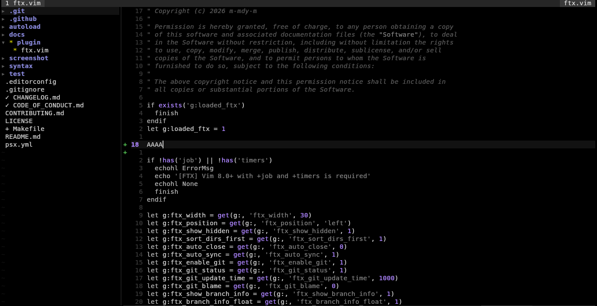

# FTX - File Tree eXplorer

Fast async file browser for Vim with git integration.




## What is FTX

Clean tree view of your project files with real-time git status indicators. Built for speed with async operations and minimal overhead.

No dependencies. No bloat. Just a file tree that works.

## Features

- Async file operations
- Git status integration
- Simple interface
- Lightweight
- Vim 8.0+ compatible

## Requirements

- Vim 8.0 or later with +job and +timers
- git (optional, for git integration)

Check if your Vim supports required features:

```vim
:echo has('job') && has('timers')
```

## Installation

### vim-plug

```vim
Plug 'm-mdy-m/ftx.vim'
```
Then run:
```bash
:PlugInstall
```

### Manual

```bash
git clone https://github.com/m-mdy-m/ftx.vim
cd ftx.vim
make install
```

## Quick Start

```vim
:FTX            " Open tree in current directory
:FTXToggle      " Toggle tree visibility
```

## Keys
Inside FTX window:

| Key | Action |
|-----|--------|
| `o`, `Enter` | Open file / Toggle directory |
| `t` | Open in new tab |
| `s` | Open in horizontal split |
| `v` | Open in vertical split |
| `r` | Refresh tree |
| `R` | Refresh git status |
| `I` | Toggle hidden files |
| `-` | Go to parent directory |
| `~` | Go to home directory |
| `q` | Close FTX |
## Git Status Indicators

Symbols appear **before** the filename:

```
+ staged.js       # Staged for commit
* modified.js     # Modified, not staged
? untracked.js    # Not tracked by git
- deleted.js      # Deleted
! conflict.js     # Merge conflict
```

Branch info in status line:

```
myproject [main] ↑2 ↓1 $
          ↑      ↑  ↑  ↑
       branch  ahead behind stash
```

- `↑n` - Ahead by n commits
- `↓n` - Behind by n commits  
- `$` - Stash exists


## Documentation

Full documentation: [docs/FILE_TREE.md.md](docs/FILE_TREE.md.md)
Example Custom Configuration:     [examples/examples.config.vim](examples/examples.config.vim)

## Development

Run tests:

```bash
make test
```

Create version tag:

```bash
make tag
```

Show version:

```bash
make version
```

## Contributing

Contributions welcome. Keep changes focused and include tests for new features.

See [CONTRIBUTING.md](CONTRIBUTING.md) for details.

## License

MIT License - Copyright (c) 2026 m-mdy-m

See [LICENSE](LICENSE) for full text.

## Credits

Inspired by:
- **netrw** - Vim's built-in file browser
- **NERDTree** - Popular tree explorer
- **fern.vim** - Modern async file explorer
- **ranger.vim.vim** - Modern async file explorer

Built with simplicity and performance in mind.